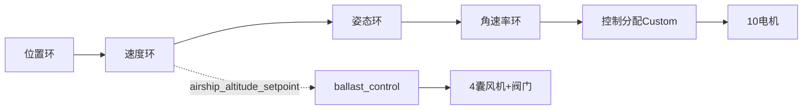

# 01 - 飞艇概述与控制架构

**文档版本**: 3.0 (基于2026-08-30全量代码分析, V2架构)
**最后更新**: 2026-08-30

## 1. 基本信息

| 项目 | 值 |
|------|------|
| 项目名称 | 灵云01号 (Lingyun01) 四气囊混合升力/推进飞艇 |
| 开发公司 | 灵云境界航空科技有限公司 |
| 基础框架 | PX4-Autopilot (深度定制,基于v1.14+) |
| 机型编号 | 2058 |
| 实飞机型文件 | `ROMFS/px4fmu_common/init.d/airframes/2058_lingyun01` |
| 仿真机型文件 | `build/.../init.d-posix/airframes/2058_gz_lingyun01` (SITL) |
| MAVLink类型 | `MAV_TYPE_AIRSHIP` (7) |
| 飞控硬件 | 雷迅x25-evo (实飞) / Gazebo Harmonic (仿真) |
| 通用默认参数 | `ROMFS/px4fmu_common/init.d/rc.lingyun01_defaults` |
| 飞艇通用层 | `ROMFS/px4fmu_common/init.d/rc.airship_defaults` + `rc.airship_apps` |
| 3D模型 | `Tools/simulation/gz/models/lingyun01/model.sdf` (1341行) |
| 气动插件 | `Tools/simulation/gz/plugins/airship_dynamics/AirshipDynamics.cc` (676行) |

## 2. 飞艇物理特性(V2, 关键约束)

### 2.1 中性浮力与四囊构型
- 起飞重量(仿真值): 2206 kg (设计起飞重量仍在核算)
- 主气囊: 2×主囊(Y=±3.3, r=3.2) + 2×副囊(Y=±8.6, r=2.6) — **四气囊构型**
- 总浮力基准 2206kg, 气动浮力中心(0,0,-1.0) 比重心(0,0,-1.5) 高 0.5m → **摆锤被动稳定**
- 净浮力: 0 kgf, **悬停推力为零** — QGC不能假设"悬停=有推力"
- 气囊满载空气质量 4×128.5=514kg (占全重23%, 需计入惯量, 平行轴定理 Ixx/Izz += m·y²)

### 2.2 大惯量特性
- 转动惯量(SolidWorks): Ixx=44700, Iyy=112200, Izz=145500 kg·m²
- 附加质量(Kirchhoff): m11=187, m22=1496, m33=787 (线), 5000×3 (角)
- 响应迟缓, PID调参需保守; Munk力矩(速度耦合失稳)需前馈补偿

### 2.3 气动参数(SDF/AirshipDynamics)
- 粘性: force_inviscid=5.0, force_viscous=270; 力矩400/200
- 轴向阻力系数=30 (三轴全分解)
- 旋转阻尼: 45000/220000/30000 N·m·s/rad (x/y/z)

## 3. 4DOF+控制架构(V2)

| 控制量 | 实现方式(V2) | 关键说明 |
|--------|---------|---------|
| Thrust X | 推进电机(6-9)同向 | 可反转[-0.6,+0.6], 负值=纯差动原地转向 |
| Thrust Z | 上升电机(0-3)四角 或 下降电机(4-5)中轴 | 上升/下降互斥防对冲 |
| Torque X (Roll) | **上升电机左右差动**(力臂PY≈6.34m) | **V2新增横滚闭环**(旧方案无Roll控制) |
| Torque Y (Pitch) | 升力电机前后差动+推进抬头补偿+Munk前馈 | 上升组力臂反比加权(前1.456/后0.544) |
| Torque Z (Yaw) | 推进电机左右差动 | Takeoff/Land强制为0 |
| 浮力(垂直) | 四囊同步充放气(风机+常闭阀) | 与姿态控制解耦, 经airship_altitude_setpoint耦合高度目标 |

## 4. 电机布局(V2, 10电机无舵机)

### 4.1 上升电机(0-3, 4×T-MOTOR A10, 222.5N)
| 电机 | 位置FLU(X,Y,Z) | 旋向 | motorConstant |
|------|----------------|------|---------------|
| M0上升左前 | (7.557, 6.338, -0.584) | ccw | +1.608e-03 |
| M1上升右前 | (7.557, -6.337, -0.584) | cw | +1.608e-03 |
| M2上升左后 | (-9.843, 5.814, -0.584) | cw | +1.608e-03 |
| M3上升右后 | (-9.843, -5.812, -0.584) | ccw | +1.608e-03 |

- 推力向上, 四角布局, 承担: 垂直上升 + 俯仰前后差动 + **横滚左右差动**
- 上升组前后力臂不等(前7.557/后9.843), 分配器做力臂反比加权

### 4.2 下降电机(4-5, 2×T-MOTOR A10, 222.5N)
| 电机 | 位置FLU(X,Y,Z) | 旋向 | motorConstant |
|------|----------------|------|---------------|
| M4下降前 | (6.957, 0.017, 0.505) | cw | -1.608e-03 |
| M5下降后 | (-11.443, 0.017, 0.505) | ccw | -1.608e-03 |

- 推力向下, 中轴前后布局, 力臂硬编码 6.957/11.443m

### 4.3 推进电机(6-9, 4×HOBBYWING P65M, 1352.4N)
| 电机 | 位置FLU(X,Y,Z) | 旋向 | motorConstant |
|------|----------------|------|---------------|
| M6推进左前 | (2.230, 5.888, -2.378) | **cw** | +8.677e-03 |
| M7推进右前 | (2.230, -5.887, -2.378) | **ccw** | +8.677e-03 |
| M8推进左后 | (-2.971, 5.888, -2.378) | **ccw** | +8.677e-03 |
| M9推进右后 | (-2.972, -5.887, -2.378) | **cw** | +8.677e-03 |

- 推力向前, 位于重心下方(PZ=0.878m FRD), 前进时产生抬头力矩(由升力电机补偿)
- **同杆对转**(M6cw+M8ccw左杆, M7ccw+M9cw右杆): 差动偏航时反扭矩等量反向, 净滚转恒0
- **可反转**: 输出范围[-0.6,+0.6], 反转用于纯差动原地转向
- CA_AS_PROP_MAX=0.6 全局限油(与AS_YAW_TMAX=0.8为性能拐点最优配置)

### 4.4 浮力执行机构(V2, 4囊×2=8通道)
| 执行器 | 数量 | 控制方式 | 说明 |
|--------|------|---------|------|
| 风机(单向PWM) | 4 | 连续0~1占空比 | 仅可充气, 不可抽气 |
| 阀门(常闭24V电磁阀) | 4 | 二值0/1 | 排气=压差自然排气; 断电自动关闭(安全位) |

- 充气 = 风机+阀门同开; 排气 = 仅阀门
- 四囊完全同步充放气(高度调节), 气囊不参与横滚(横滚由电机负责)

## 5. 关键模块清单

| 模块 | 路径 | 职责 |
|------|------|------|
| airship_att_control | `src/modules/airship_att_control/` | 4DOF控制器+9个FlightTask+PropTest, 参数前缀 `AS_` |
| ballast_control | `src/modules/ballast_control/` | 浮力PID(50Hz)+紧急排气, 参数前缀 `BALLOON_*/BLOWER_*/VALVE_*` |
| ballast_output | `src/modules/ballast_output/` | ballast_setpoint → actuator_servos(4囊8通道) → PWM, 50Hz |
| ActuatorEffectivenessCustom | `src/modules/control_allocator/VehicleActuatorEffectiveness/ActuatorEffectivenessCustom.cpp` | 手工覆盖式4DOF+浮力分配, 参数前缀 `CA_AS_*` |
| AirshipLandDetector | `src/modules/land_detector/AirshipLandDetector.cpp` | 运动学着陆检测(不看油门), 参数前缀 `LNDAS_*` |
| AirshipDynamics(GZ插件) | `Tools/simulation/gz/plugins/airship_dynamics/` | 浮力+四囊质量+Munk力矩+粘性力+轴向阻力+旋转阻尼 |

## 6. 物理常数(控制分配参数, V2)

| 参数 | 值 | 说明 |
|------|------|------|
| CA_AS_K_LUP | 222.5 N | 上升电机推力系数(T-MOTOR A10, 22.7kg) |
| CA_AS_K_LDN | 222.5 N | 下降电机推力系数(同型号, 声明但算法未使用) |
| CA_AS_K_PROP | 1352.4 N | 推进电机推力系数(P65M, 138kg) |
| CA_AS_PZ_PROP | 0.878 m | 推进电机到重心垂直距离 |
| CA_AS_PX_FRONT | 7.557 m | 前组上升电机力臂 |
| CA_AS_PX_REAR | 9.843 m | 后组上升电机力臂 |
| CA_AS_PROP_MAX | 0.6 | 推进电机最大油门 |
| CA_AS_PT_EN/SIDE/THR | 0/0/0.3 | PropTest使能/侧选/油门 |

## 7. 操纵映射(遥控器/虚拟摇杆)

| 摇杆 | Manual模式 | Stable模式 | Altitude模式 |
|------|-----------|-----------|--------------|
| Throttle(油门) | 前进推力(截负) | 前进推力 | 前进推力(pitch杆) |
| Pitch杆 | **俯仰角±15° + 升降速度直通** | 升降速度(±1) | 前进(pitch_stick) |
| Roll杆 | 偏航角速率 | 偏航角速率 | **偏航角速率(悬停转向P7: 需推进时自动给0.06最小forward)** |
| Yaw杆 | — | **俯仰角±15°** | 俯仰角±15° |
| 油门(Altitude) | — | — | 高度目标调节(±AS_ALT_SRATE, 中位死区0.05) |

**注意**: 各模式杆法不同(Manual的pitch杆双职能, Stable的yaw杆控俯仰), QGC虚拟摇杆提示需按模式区分。
