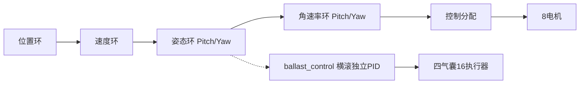

# 01 - 飞艇概述与控制架构

## 1. 基本信息

| 项目 | 值 |
|------|------|
| 项目名称 | 灵云01号 (Lingyun01) 混合升力/推进飞艇 |
| 开发公司 | 灵云境界航空科技有限公司 |
| 基础框架 | PX4-Autopilot (深度定制,基于v1.14+) |
| 机型编号 | 2058 |
| 机型文件 | `ROMFS/px4fmu_common/init.d/airframes/2058_lingyun01` (仿真+实飞合一) |
| MAVLink类型 | `MAV_TYPE_AIRSHIP` (7) |
| 飞控硬件 | 雷迅x25-evo (实飞) / Gazebo Harmonic (仿真) |
| 默认参数 | `ROMFS/px4fmu_common/init.d/rc.lingyun01_defaults` |

## 2. 飞艇物理特性(关键约束)

### 2.1 中性浮力特性
- 起飞重量(仿真值): 2206 kg (设计起飞重量仍在核算中)
- 总体积: 1800 m³ (氦气)
- 净浮力: 0 kgf (通过配重达到中性浮力)
- **悬停推力为零** — 与传统多旋翼的本质区别,QGC不能假设"悬停=有推力"

### 2.2 大惯量特性
- 转动惯量(SolidWorks): Ixx=44700, Iyy=112200, Izz=145500 kg·m²
- 响应迟缓,PID调参需保守
- 自然阻尼极小,需要D项提供阻尼

### 2.3 气动参数
- CD_axial=0.025, CD_lateral=0.65, CD_vertical=0.65
- M_added_axial=0.02, M_added_lat=0.85, M_added_vert=0.85

## 3. 4自由度控制架构

**控制链路说明**:
- 主链路(实线): 位置→速度→姿态(Pitch/Yaw)→角速率→控制分配→8电机
- 横滚链路(虚线): 姿态环Roll → ballast_control独立级联PID → 四气囊16执行器(8风机+8阀门)
- att_control的torque_x置0,横滚不通过电机控制

| 控制量 | 实现方式 | 关键说明 |
|--------|---------|---------|
| Thrust X | 推进电机(4-7)同向 | 水平前进 |
| Thrust Z | 升力电机(0-3)同向 | M0/M3上升, M1/M2下降 |
| Torque Y (Pitch) | 升力电机前后差动 | 前部电机优先方案 |
| Torque Z (Yaw) | 推进电机左右差动 | 受气动力矩限制,大角度转向需S形 |
| Roll (Torque X) | 四气囊空气囊浮力差 | ballast_control独立级联PID,att_control torque_x置0,已验证稳态<1deg |

## 4. 电机布局(新方案无舵机)

### 4.1 升力电机(0-3, 4×1.5kW)
| 电机 | 位置(PX,PY,PZ) | 方向 | 推力方向 | CT | KM | AZ |
|------|----------------|------|---------|----|----|-----|
| M0(前1) | (11.237, 0, -0.340) | CCW | 向上(上升,20kg) | 0.1106 | 1 | -1 |
| M1(前2) | (9.227, 0, -0.340) | CW | 向下(下降,40kg) | 0.2212 | -1 | +1 |
| M2(后1) | (-13.523, 0, -0.340) | CW | 向下(下降,40kg) | 0.2212 | -1 | +1 |
| M3(后2) | (-15.513, 0, -0.340) | CCW | 向上(上升,20kg) | 0.1106 | 1 | -1 |

- 位置: 重心上方 (Z=+0.34m in FLU / PZ=-0.340 in FRD)
- 旋转轴: Z轴(Yaw轴),反扭矩只产生Yaw力矩,前后对称抵消
- **推力方向固定** (无舵机),通过 `CA_ROTOR*_AZ` 参数控制方向

### 4.2 推进电机(4-7, 4×15kW)
| 电机 | 位置(PX,PY,PZ) | 方向 | CT | KM |
|------|----------------|------|----|----|
| M4(左前LF) | (2.559, -5.281, 1.503) | CCW | 1.0 | 0.05 |
| M5(左后LB) | (-2.535, -5.281, 1.503) | CW | 1.0 | -0.05 |
| M6(右前RF) | (2.559, 5.293, 1.503) | CCW | 1.0 | 0.05 |
| M7(右后RB) | (-2.535, 5.293, 1.503) | CW | 1.0 | -0.05 |

- 位置: 重心下方 (PZ=1.503m in FRD)
- 旋转轴: X轴(Roll轴),反扭矩产生Roll,前后对称抵消
- **推力在重心下方产生抬头力矩**,通过升力电机M1+M3补偿

### 4.3 浮力执行机构(8-11)
| 输出 | 设备 | PWM_FUNC | 说明 |
|------|------|---------|------|
| 输出8 | 左鼓风机 | PWM_AUX_FUNC1=201(Servo1) | 空气囊充气 |
| 输出9 | 右鼓风机 | PWM_AUX_FUNC2=202(Servo2) | 空气囊充气 |
| 输出10 | 左阀门 | PWM_AUX_FUNC3=203(Servo3) | 排气控制 |
| 输出11 | 右阀门 | PWM_AUX_FUNC4=204(Servo4) | 排气控制 |

## 5. 关键模块清单

| 模块 | 路径 | 职责 |
|------|------|------|
| airship_att_control | `src/modules/airship_att_control/` | 4DOF姿态控制,参数前缀 `AS_` |
| ballast_control | `src/modules/ballast_control/` | 浮力PID调节+横滚主动控制(四气囊独立级联PID),参数前缀 `BALLOON_*/BLOWER_*/VALVE_*/TRIM_BALLOON_*` |
| ballast_output | `src/modules/ballast_output/` | ballast_setpoint → actuator_servos 桥接 |
| ActuatorEffectivenessCustom | `src/modules/control_allocator/VehicleActuatorEffectiveness/ActuatorEffectivenessCustom.cpp` | 4DOF控制分配+俯仰耦合补偿 |
| AirshipLandDetector | `src/modules/land_detector/AirshipLandDetector.cpp` | 飞艇着陆检测 |

## 6. 物理常数(控制分配用)

| 参数 | 值 | 说明 |
|------|------|------|
| CA_AS_K_LUP | 196.0 N | 上升电机推力系数 |
| CA_AS_K_LDN | 392.0 N | 下降电机推力系数(上升的2倍) |
| CA_AS_K_PROP | 726.3 N | 推进电机推力系数 |
| CA_AS_PZ_PROP | 1.503 m | 推进电机到重心垂直距离 |
| CA_AS_PX_FRONT | 10.232 m | 前部升力电机到重心水平距离 |
| CA_AS_PX_REAR | 14.518 m | 后部升力电机到重心水平距离 |

## 7. 操纵映射(遥控器/虚拟摇杆)

| 摇杆 | 映射 | 说明 |
|------|------|------|
| Throttle(油门) | 前进推力(Thrust X) | 推进电机同向 |
| Pitch杆(俯仰) | 高度调节(Thrust Z) | 升力电机,AS_ALT_SRATE控制速率 |
| Roll杆(横滚) | 偏航角速率(Torque Z) | 推进电机左右差动 |
| Yaw杆(偏航) | 俯仰角速率(Torque Y) | 升力电机前后差动 |

**注意**: 此映射与传统多旋翼不同,QGC的虚拟摇杆UI需要按此调整。
