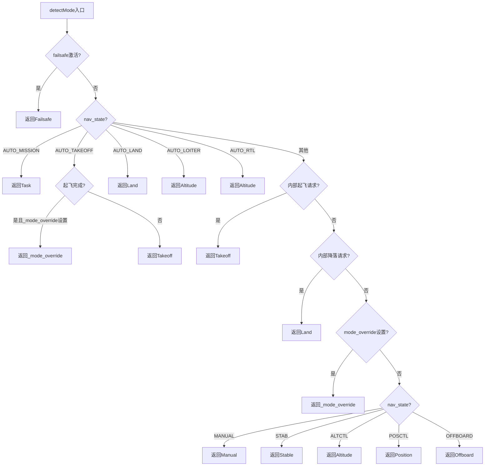
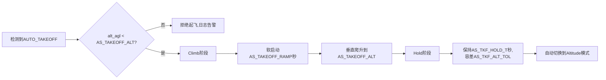
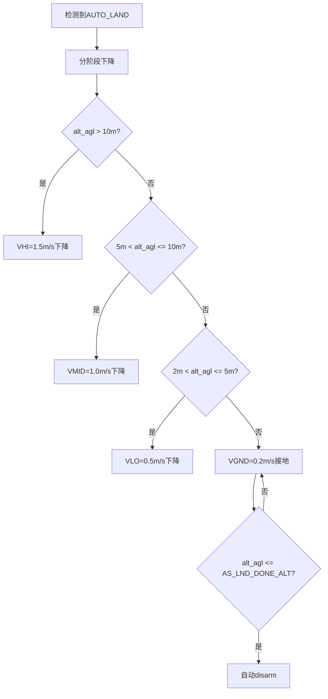
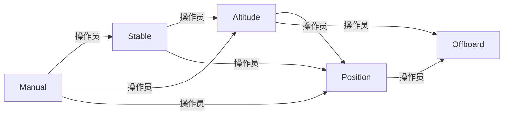
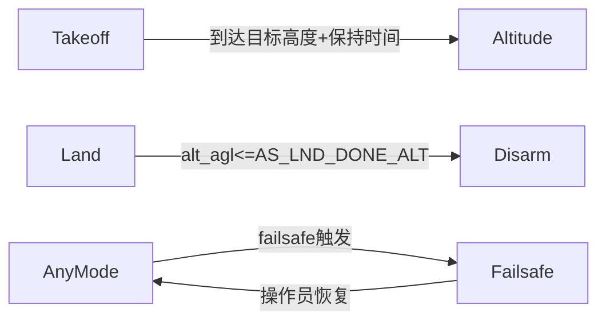
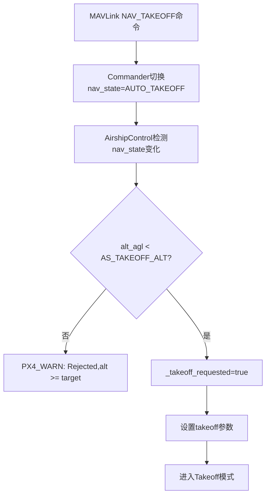
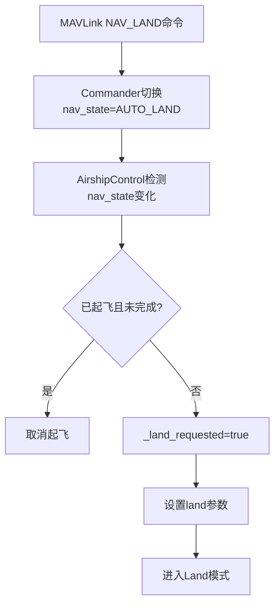
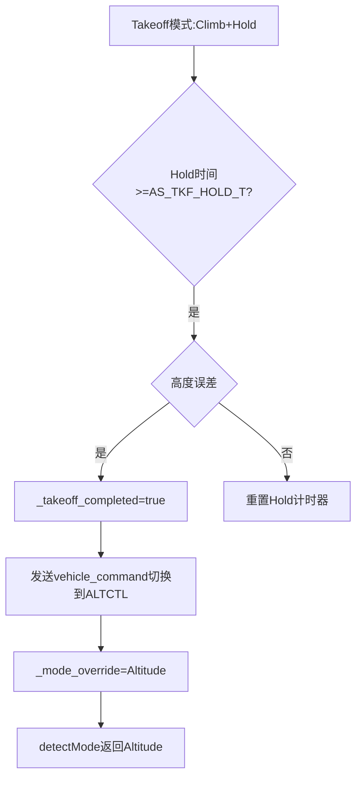

# 04 - 飞行模式与状态机

## 1. AirshipMode枚举

**代码位置**: `src/modules/airship_att_control/AirshipControl.hpp` L46-56

```cpp
enum class AirshipMode : uint8_t {
    Manual    = 0,
    Stable    = 1,
    Altitude  = 2,
    Position  = 3,
    Offboard  = 4,
    Takeoff   = 5,
    Land      = 6,
    Failsafe  = 7,
    Task      = 8,
};
```

**重要变更**: 旧文档 `Task=7` 已作废,实际 `Failsafe=7, Task=8`

---

## 2. 模式检测逻辑(detectMode)

**代码位置**: `src/modules/airship_att_control/AirshipControl.cpp` L311+



**说明**:
- AUTO_LOITER 和 AUTO_RTL 在飞艇中自动映射到 Altitude 模式
- 起飞完成后通过 `_mode_override` 切换到 Altitude 模式
- 内部起飞/降落请求优先于 nav_state

---

## 3. 各模式详细说明

### 3.1 Manual (手动模式, =0)

| 项目 | 说明 |
|------|------|
| 输入 | 遥控器/虚拟摇杆 |
| 输出 | 直接映射到推力/力矩设定值 |
| 自动控制 | 无 |
| 激活条件 | nav_state=MANUAL |
| 退出条件 | 操作员切换模式 |
| QGC显示 | "Manual" |

**操纵映射**:
- Throttle → Thrust X (推进电机)
- Pitch杆 → 高度调节
- Roll杆 → 偏航角速率
- Yaw杆 → 俯仰角速率

### 3.2 Stable (自稳定模式, =1)

| 项目 | 说明 |
|------|------|
| 输入 | 遥控器/虚拟摇杆 |
| 输出 | 推力/力矩设定值(含姿态稳定) |
| 自动控制 | 姿态环激活(俯仰/偏航角稳定) |
| 激活条件 | nav_state=STAB |
| 退出条件 | 操作员切换模式 |
| QGC显示 | "Stabilized" |

**悬停检测**: `thrust_x < 0.01f` 时推进电机关闭,自动保持悬停。

### 3.3 Altitude (定高模式, =2)

| 项目 | 说明 |
|------|------|
| 输入 | 遥控器/虚拟摇杆(水平), 目标高度(垂直) |
| 输出 | 推力/力矩设定值 |
| 自动控制 | 高度PID + 速度PID + 姿态环 |
| 激活条件 | nav_state=ALTCTL 或 AUTO_LOITER 或 AUTO_RTL 或起飞完成 |
| 退出条件 | 操作员切换模式 |
| QGC显示 | "Altitude" / "Loiter" / "RTL" |

**控制律**:
- 高度PID: AS_ALT_P/I/D + AS_ALT_VFF前馈
- 速度PID(水平): AS_VEL_XY_P/I/D
- 高度限位: AS_ALT_MIN <= 目标高度 <= AS_ALT_MAX
- 软限位: alt > AS_ALT_SOFT 时线性递减上升推力

### 3.4 Position (定点模式, =3)

| 项目 | 说明 |
|------|------|
| 输入 | 遥控器/虚拟摇杆(微调), 目标位置 |
| 输出 | 推力/力矩设定值 |
| 自动控制 | 位置PID + 速度PID + 姿态环 |
| 激活条件 | nav_state=POSCTL |
| 退出条件 | 操作员切换模式 |
| QGC显示 | "Position" |

**控制律**:
- 位置PID: AS_POS_XY_P (输出目标速度)
- 速度PID: AS_VEL_XY_P/I/D (输出推力)
- 位置误差限位: |pos_error| <= AS_POS_XY_MAX
- 速度限位: |vel_target| <= AS_VEL_XY_MAX

### 3.5 Offboard (外部控制模式, =4)

| 项目 | 说明 |
|------|------|
| 输入 | vehicle_attitude_setpoint (来自MAVLink SET_ATTITUDE_TARGET) |
| 输出 | 推力/力矩设定值 |
| 自动控制 | 姿态环(根据setpoint) |
| 激活条件 | nav_state=OFFBOARD + offboard_control_mode消息有效 |
| 退出条件 | 操作员切换模式 或 offboard_control_mode超时 |
| QGC显示 | "Offboard" |

**Offboard接口**:
- 通过 `SET_ATTITUDE_TARGET` 消息控制
- 飞艇特殊映射: `body_roll_rate→thrust_x`, `thrust→thrust_z`
- 详见 [03_interfaces.md](03_interfaces.md) 第4节

### 3.6 Takeoff (起飞模式, =5)

| 项目 | 说明 |
|------|------|
| 输入 | 内部参数(AS_TAKEOFF_*) |
| 输出 | 推力/力矩设定值(仅升力电机) |
| 自动控制 | 高度PID爬升 |
| 激活条件 | nav_state=AUTO_TAKEOFF + 高度<AS_TAKEOFF_ALT |
| 退出条件 | 到达目标高度+保持时间完成 → 自动切换Altitude |
| QGC显示 | "Takeoff" |

**前置条件**:
1. ARMED (已解锁)
2. `alt_agl < AS_TAKEOFF_ALT` (高度低于目标高度)
3. 收到Takeoff命令 (MAVLink NAV_TAKEOFF 或 RC开关)

**起飞流程**:


**关键约束**:
- 起飞模式只激活升力电机(0-3),推进电机(4-7)必须关闭
- 控制分配器检测 `thrust_x < 0.01f` 时认为起飞/悬停模式,推进电机关闭
- 油门只对应升力电机

### 3.7 Land (降落模式, =6)

| 项目 | 说明 |
|------|------|
| 输入 | 内部参数(AS_LND_*) |
| 输出 | 推力/力矩设定值(仅升力电机) |
| 自动控制 | 高度PID分阶段下降 |
| 激活条件 | nav_state=AUTO_LAND |
| 退出条件 | alt_agl <= AS_LND_DONE_ALT → 自动disarm |
| QGC显示 | "Land" |

**降落流程**:


**关键约束**:
- 降落模式只激活升力电机(0-3),推进电机(4-7)必须关闭
- Done判断仅使用 `alt_agl <= AS_LND_DONE_ALT`,不依赖 `vehicle_land_detected.landed`
- 接地速度 AS_LND_VGND=0.2m/s gentle touchdown

### 3.8 Failsafe (失控保护模式, =7)

| 项目 | 说明 |
|------|------|
| 输入 | 内部状态 |
| 输出 | 推力/力矩设定值(保守) |
| 自动控制 | 保持当前模式或返航 |
| 激活条件 | RC丢失 / 数据链丢失 / 低电量 / 内部故障 |
| 退出条件 | 操作员恢复控制 |
| QGC显示 | "Failsafe" |

**Failsafe触发源**:

| 触发源 | 实飞参数 | 实飞动作 |
|--------|---------|---------|
| RC丢失 | COM_RC_LOSS_T=5s, NAV_RCL_ACT=3 | 返航 |
| 数据链丢失 | COM_DL_LOSS_T=30s, NAV_DLL_ACT=3 | 返航 |
| 低电量 | COM_LOW_BAT_ACT=1 | 自动降落 |
| 内部故障 | COM_FAIL_ACT_T=30s | 30秒后执行failsafe动作 |

**飞艇failsafe特殊性**:
- 飞艇中性浮力,断电后缓慢飘移而非坠落
- 不能简单复用多旋翼的"立即降落"策略
- 仿真禁用所有failsafe (NAV_RCL_ACT=0, NAV_DLL_ACT=0)
- 实飞首飞启用所有failsafe

### 3.9 Task (任务模式, =8)

| 项目 | 说明 |
|------|------|
| 输入 | position_setpoint_triplet (来自navigator) |
| 输出 | 推力/力矩设定值 |
| 自动控制 | 位置PID + 速度PID + 姿态环 |
| 激活条件 | nav_state=AUTO_MISSION |
| 退出条件 | 任务完成 或 操作员切换模式 |
| QGC显示 | "Mission" |

**任务特点**:
- 起飞任务: 只能设置高度(垂直爬升)
- 航点任务: 需考虑大惯量,提前规划减速
- 降落任务: 需设置降落区域(考虑漂移)
- 偏航大角度转向需S形(气动力矩限制)

---

## 4. 模式切换状态机

### 4.1 用户主动切换



### 4.2 自动切换



### 4.3 模式切换内部逻辑

**_mode_override机制**:
- 起飞完成后设置 `_mode_override = AirshipMode::Altitude`
- detectMode优先返回 `_mode_override` (如果已设置)
- 用户切换到其他模式时清除 `_mode_override`

**内部起飞/降落状态清除**:
当用户切换到 MANUAL/STAB/ALTCTL/POSCTL/OFFBOARD 模式时,清除内部起飞/降落状态:
- `_takeoff_requested = false`
- `_takeoff_completed = false`
- `_land_requested = false`

切换到 AUTO_MISSION/AUTO_LOITER/AUTO_RTL 时,如果起飞正在进行则不清除。

---

## 5. 模式与电机激活映射

| 模式 | 升力电机(0-3) | 推进电机(4-7) | 鼓风机/阀门(8-11) |
|------|-------------|-------------|------------------|
| Manual | 激活(手动控制) | 激活(手动控制) | 由ballast_control独立控制 |
| Stable | 激活(姿态稳定) | 激活(thrust_x控制) | 由ballast_control独立控制 |
| Altitude | 激活(高度PID) | 激活(thrust_x控制) | 由ballast_control独立控制 |
| Position | 激活(高度PID) | 激活(位置PID) | 由ballast_control独立控制 |
| Offboard | 激活(根据setpoint) | 激活(根据setpoint) | 由ballast_control独立控制 |
| **Takeoff** | **激活(爬升)** | **关闭** | 由ballast_control独立控制 |
| **Land** | **激活(下降)** | **关闭** | 由ballast_control独立控制 |
| Failsafe | 激活(保守控制) | 视情况 | 由ballast_control独立控制 |
| Task | 激活 | 激活 | 由ballast_control独立控制 |

**关键约束**:
- Takeoff/Land 模式推进电机必须关闭 (`thrust_x < 0.01f` 检测)
- ballast_control 是独立模块,在所有模式下持续工作(如果 BALLOON_AST_EN=1)

---

## 6. 起飞/降落前置条件与命令处理

### 6.1 起飞命令处理流程

**代码位置**: `src/modules/airship_att_control/AirshipControl.cpp` L142-173



### 6.2 降落命令处理流程

**代码位置**: `src/modules/airship_att_control/AirshipControl.cpp` L175-196



### 6.3 起飞完成自动切换


