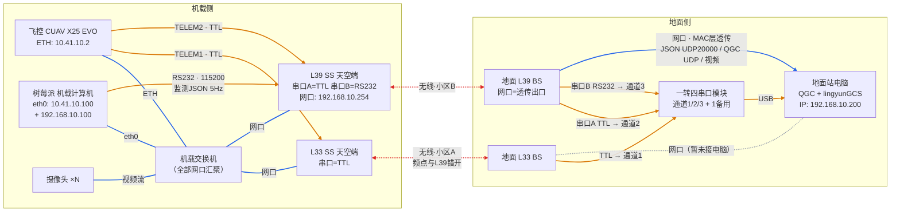

# 灵云01号 通讯链路说明（L33 + L39 双数传 + 飞控网口）

> **版本**：V1.1（2026-09-07，按当前实际接线整理）
> **V1.1 变更**：修正 L33 网口状态表述（链路可用，地面 BS 网口暂未接电脑）、拓扑图改为 Mermaid 着色版、新增第 9 节联调验证清单与第 10 节二期演进。
> **关联文档**：
>
> - [双链路冗余通讯方案.md](双链路冗余通讯方案.md)（早期方案，本文件为落地实况）
> - [Insight Link产品使用手册-20230807.pdf](<Insight%20Link产品使用手册-20230807.pdf>)（数传机制权威来源）
> - [../地面站/地面站对接协议.md](../地面站/地面站对接协议.md)（监测数据 JSON 帧格式）
> - [../PX4飞控对接文档/07_实时监控协议对接文档.md](../PX4飞控对接文档/07_实时监控协议对接文档.md)（MAVLink 遥测内容与频率）
> - [../PX4飞控对接文档/08_气囊压差uXRCE-DDS同步协议.md](../PX4飞控对接文档/08_气囊压差uXRCE-DDS同步协议.md)（压差链路）

---

## 1. 总览

全艇对外通讯由 **L33、L39 两对 Insight Link 数传**（1.35–1.47GHz 无线，MAC 层透传网桥 + 串口透传）承担，另有 **4G MQTT** 独立上云链路。整体构成：

| 链路        | 物理构成                                                                                     | 承载内容                                                                   |
| ----------- | -------------------------------------------------------------------------------------------- | -------------------------------------------------------------------------- |
| ① 机载网   | 飞控 ETH + 树莓派 eth0 + L33/L39 网口 + 摄像头 → 机载交换机                                 | MAVLink 遥测、气囊压差 DDS、视频流（机载内部）                             |
| ② L33 链路 | 飞控 TELEM1 ↔ L33 串口(TTL)；L33 网口已接交换机（地面 BS 网口暂未接电脑）                   | 主 MAVLink 遥测（串口）；网口透传备用（与 L39 同能力，接入地面电脑即承载） |
| ③ L39 链路 | 飞控 TELEM2 ↔ L39 串口A(TTL)、树莓派 232 ↔ L39 串口B(232)；L39 网口接交换机 + 地面网口已接 | 备 MAVLink 遥测（串口A）、监测数据 JSON（串口B）、网口透传全部业务         |
| ④ 4G 链路  | 树莓派 4G 模块 → EMQX 云                                                                    | 遥测 JSON 上云（远程监控，与数传无关）                                     |

---

## 2. 接线清单

### 2.1 机载侧

| # | 从                        | 到                      | 接口/电平                                                          | 用途                                                       |
| - | ------------------------- | ----------------------- | ------------------------------------------------------------------ | ---------------------------------------------------------- |
| 1 | 飞控 TELEM1               | L33 天空端(SS) 数传串口 | TTL，波特率须与飞控`SER_TEL1_BAUD` 一致（数传可选 57600/115200） | 主 MAVLink 遥测                                            |
| 2 | 飞控 TELEM2               | L39 天空端(SS) 串口A    | TTL，波特率须与飞控`SER_TEL2_BAUD` 一致                          | 备 MAVLink 遥测                                            |
| 3 | 树莓派（机载计算机）RS232 | L39 天空端(SS) 串口B    | RS-232，115200 8N1                                                 | 监测数据 JSON 下传（0xAA 0x55 + JSON，5Hz）                |
| 4 | 飞控 ETH                  | 转RJ45 → 机载交换机    | 100M 以太网，静态 IP 10.41.10.2                                    | MAVLink UDP 14550 + uXRCE-DDS 8888                         |
| 5 | 树莓派 eth0               | 机载交换机              | 以太网，双静态 IP（见 2.4）                                        | mavros 监测、DDS 压差、UDP 20000 下传                      |
| 6 | L33 SS 网口               | 机载交换机              | 以太网                                                             | 网络透传（链路可用；地面 BS 网口暂未接电脑，作备用网络链） |
| 7 | L39 SS 网口               | 机载交换机              | 以太网                                                             | 网络透传（当前唯一无线网络出口）                           |
| 8 | 摄像头 ×N                | 机载交换机              | 以太网                                                             | 视频流（经 L39 网口透传到地面）                            |

> **L39 双串口说明**：L39 有两路独立串口（UART0：PIN1/2/5，UART1：PIN6/7/10，各支持 TTL/RS-232 电平，由 APP 配置），可一路配 TTL 接 TELEM2、另一路配 RS-232 接树莓派，**同时工作互不冲突**。具体哪路接哪个，安装时按 J30J 引脚核对。

> **树莓派 232 对接说明**：树莓派侧串口设备由 `link_node.serial_device` 参数配置（`airship_bringup/config/airship_params.yaml`）。**当前该参数临时指向微雪板 RS232（`/dev/ttyAMA0`）供台架调试**；L39 232 正式接入后应改为 udev 固定符号链接 `/dev/airship_link`（规则见 `tools/70-airship-usb.rules`），并保持 115200 8N1 与数传串口B 一致。

### 2.2 地面侧

| # | 从                         | 到                    | 接口                               | 用途                                                                                                                                                                                        |
| - | -------------------------- | --------------------- | ---------------------------------- | ------------------------------------------------------------------------------------------------------------------------------------------------------------------------------------------- |
| 1 | 地面 L33 基站(BS) 数传串口 | 一转四串口模块 通道1  | TTL（配 USB 转 TTL），波特率同机载 | TELEM1 遥测 → QGC / lingyunGCS（串口）                                                                                                                                                     |
| 2 | 地面 L39 BS 串口A          | 一转四串口模块 通道2  | TTL，波特率同机载                  | TELEM2 遥测 → QGC（串口）                                                                                                                                                                  |
| 3 | 地面 L39 BS 串口B          | 一转四串口模块 通道3  | RS-232，115200                     | 监测数据 JSON → lingyunGCS（串口）                                                                                                                                                         |
| 4 | 一转四串口模块             | lingyunGCS 地面站电脑 | USB                                | 枚举出 4 路 USB 串口（3 用 1 备）                                                                                                                                                           |
| 5 | 地面 L39 BS 网口           | 地面站电脑网口        | 以太网                             | 网络透传出口（监测 UDP、QGC UDP、视频）                                                                                                                                                     |
| 6 | 地面 L33 BS 网口           | 暂未接电脑            | -                                  | **链路本身可用**（L33/L39 谁接电脑都行）；地面站电脑单网口已接 L39 BS。接入前须核实 L33 对 IP 不与 L39 冲突；双网口并存须独立网卡，禁止普通交换机直连两 BS（环路，见 7.2③、第 8 节） |

### 2.3 无线侧

| 无线对 | 组成              | 配置状态                                                                                  |
| ------ | ----------------- | ----------------------------------------------------------------------------------------- |
| L33 对 | 机载 SS + 地面 BS | 小区 ID 对内一致（配对入网）；**与 L39 对小区 ID 不同（已确认）**，两对组网互相隔离 |
| L39 对 | 机载 SS + 地面 BS | 同上                                                                                      |

> 小区 ID 不同解决的是**组网隔离**（L33 SS 不会入网到 L39 BS）；但**频点仍必须错开**——同频段物理层射频干扰与小区 ID 无关，两对若选到同一频点仍会互扰（见 7.2②、风险 #2）。自适应选频模式下，两对的频点集合应勾选为互不重叠。

### 2.4 IP 地址规划

| 设备                   | IP                                       | 说明                                                                                                                                                                         |
| ---------------------- | ---------------------------------------- | ---------------------------------------------------------------------------------------------------------------------------------------------------------------------------- |
| 飞控网口               | 10.41.10.2/24                            | MAVLink UDP 14550 对端指向树莓派                                                                                                                                             |
| 树莓派 eth0            | 10.41.10.100/24                          | 飞控通讯网段                                                                                                                                                                 |
| 树莓派 eth0（第二 IP） | 192.168.10.100/24                        | 数传透传网段                                                                                                                                                                 |
| L39 系统（BS/SS）      | 192.168.10.254                           | 出厂默认，保持                                                                                                                                                               |
| 地面站电脑             | 192.168.10.200/24                        | 与树莓派 192.168.10.100 同网段直通（经 L39 透传）                                                                                                                            |
| L33 系统（BS/SS）      | ⚠️**须核实/改为 192.168.10.253** | 出厂默认同为 192.168.10.254，与 L39 同 IP；两个 SS 已同接机载交换机，若 L33 对未改过 IP 则 ARP 漂移（MAC 透传业务不受影响，但 APP 配置/QGC UDP 转串口寻址会漂移，见第 8 节） |

---

## 3. 拓扑图



> 图例：**蓝色实线** = 网口物理插线（全部汇聚到交换机，无方向）；**橙色实线** = 串口直连（不经交换机，箭头为数据流向）；**红色虚线** = 无线链路；**灰色虚线** = 暂未接线。布局上机载交换机居中，左侧为数据源设备、右侧为天空端。

**要点**：

- L33/L39 的网口都是 **MAC 层透明网桥**：机载交换机上的以太网帧原样过无线到地面 BS 网口（不对 IP 做约束）。
- 数传串口是**独立于网口的透传通道**：串口数据 ↔ 无线 ↔ 地面 BS 对应串口（TTL 进 TTL 出，232 进 232 出）。
- 当前地面 L33 BS 网口未接电脑（地面站电脑单网口已被 L39 BS 占用）→ L33 网口链路可用但暂无地面出口，单播业务仍全部走 L39，二层**不成环**。

---

## 4. 链路逐条说明（承载数据）

### 4.1 机载网（交换机内部，不经数传，地面用户不可直接见）

| 数据流                       | 方向                                     | 协议/端口            | 频率                                             | 说明                                                                  |
| ---------------------------- | ---------------------------------------- | -------------------- | ------------------------------------------------ | --------------------------------------------------------------------- |
| **飞控 MAVLink 遥测**  | 飞控(10.41.10.2) → 树莓派(10.41.10.100) | UDP 14550            | 姿态50Hz/位置30Hz/电机10Hz…（见 07 文档频率表） | mavros 仅监测不控制（fcu_url=`udp://:14550@10.41.10.2:14550`）      |
| **气囊压差**           | 树莓派 → 飞控                           | uXRCE-DDS / UDP 8888 | 0.5Hz                                            | `/fmu/in/airship_bladder_pressure`，四囊压差进 PX4 uORB，供控制逻辑 |
| **DDS 下行（暂闲置）** | 飞控 → 树莓派                           | uXRCE-DDS / UDP 8888 | ~各话题速率                                      | fmu/out 27 话题（33KB/s），树莓派侧暂无消费者                         |
| **视频流**             | 摄像头 → (出口=L39 网口)                | RTSP/私有协议        | -                                                | 机载交换机内，经 L39 透传到地面                                       |

> 气囊压差虽在机载网内传输，但地面最终能看到：PX4 固件内已有 uORB→MAVLink 桥（`bal_p0~p3`），压差会随**所有 MAVLink 出口**（TELEM1/TELEM2/网口）带出，QGC 四囊面板即来源于此。

### 4.2 L33 链路（主遥测，串口）

| 方向       | 路径                                                                               | 内容                                                                                                |
| ---------- | ---------------------------------------------------------------------------------- | --------------------------------------------------------------------------------------------------- |
| 下传       | 飞控 TELEM1 → L33 SS 串口 → 无线 → L33 BS 串口 → 一转四通道1 → QGC/lingyunGCS | MAVLink 遥测（含 bal_p0~p3 压差）                                                                   |
| 上传       | 地面软件 → 串口 → L33 BS → 无线 → L33 SS → TELEM1                             | QGC/lingyunGCS 下发的 MAVLink 指令（模式切换等）                                                    |
| 网口(备用) | 机载交换机 ↔ L33 SS 网口 ↔ 无线 ↔ L33 BS 网口（地面侧暂未接电脑）               | 链路可用，能力与 L39 网口相同；地面电脑接入后即可承载 JSON UDP / QGC UDP / 视频（接入方式见 7.2③） |

### 4.3 L39 链路（备遥测 + 监测数据 + 网口透传）

| 方向        | 路径                                                                                                                    | 内容                                                                                          |
| ----------- | ----------------------------------------------------------------------------------------------------------------------- | --------------------------------------------------------------------------------------------- |
| 下传(串口A) | 飞控 TELEM2 → L39 SS 串口A(TTL) → 无线 → L39 BS 串口A → 一转四通道2 → QGC                                          | MAVLink 遥测（与 TELEM1 同源，独立实例）                                                      |
| 下传(串口B) | 树莓派 link_node → 232 → L39 SS 串口B(RS-232) → 无线 → L39 BS 串口B → 一转四通道3 → lingyunGCS                    | 监测数据 JSON（`0xAA 0x55 <JSON>\n`，5Hz，覆盖 BMS/备用BMS/MPPT/DCDC/LoRa/FC 全部聚合状态） |
| 下传(网口)  | 树莓派 link_node → UDP 192.168.10.200:20000 → 机载交换机 → L39 SS 网口 → 无线 → L39 BS 网口 → 地面电脑 lingyunGCS | **同一份 JSON**（与串口B 双发冗余，帧格式一致）                                         |
| 下传(网口)  | 摄像头 → 机载交换机 → L39 网口透传 → 地面电脑                                                                        | 视频流                                                                                        |
| 上传(网口)  | 地面 QGC → UDP 192.168.10.254:14550/14551 → L39 BS → 无线 → L39 SS → 串口 → TELEM2                                | QGC 指令（UDP 转串口）                                                                        |
| 上传(网口)  | 地面软件任意 UDP → 树莓派 192.168.10.100                                                                               | 经透传直达树莓派（预留）                                                                      |

### 4.4 4G 链路（独立，与数传无关）

树莓派 cloud_node → MQTT over TLS(8883) → EMQX Cloud → 远程监控端。2Hz 上报同一份聚合 JSON，仅上行。

---

## 5. 承载数据汇总表

| # | 数据                | 源                        | 宿                 | 路径                                                                                                           | 格式/端口                | 频率             |
| - | ------------------- | ------------------------- | ------------------ | -------------------------------------------------------------------------------------------------------------- | ------------------------ | ---------------- |
| 1 | MAVLink 遥测(主)    | 飞控 TELEM1               | QGC/lingyunGCS     | TELEM1→L33 串口链→一转四                                                                                     | MAVLink/TTL 串口         | 同 07 文档频率表 |
| 2 | MAVLink 遥测(备)    | 飞控 TELEM2               | QGC                | TELEM2→L39 串口A 链→一转四；或地面 UDP:14550/14551 经 L39 网口反向到串口A（端口与串口编号对应见 6.2 核对项） | MAVLink                  | 同上             |
| 3 | 监测数据 JSON(串口) | 树莓派 link_node          | lingyunGCS         | 232→L39 串口B 链→一转四                                                                                      | 0xAA 0x55+JSON，115200   | 5Hz              |
| 4 | 监测数据 JSON(网口) | 树莓派 link_node          | lingyunGCS         | UDP→机载交换机→L39 网口透传                                                                                  | UDP 192.168.10.200:20000 | 5Hz              |
| 5 | 气囊压差(进飞控)    | 树莓派 bladder_bridge     | 飞控               | 机载交换机→飞控网口                                                                                           | uXRCE-DDS UDP 8888       | 0.5Hz            |
| 6 | 气囊压差(到地面)    | 飞控 MAVLink 桥 bal_p0~p3 | QGC 四囊面板       | 随链路 1/2 的 MAVLink 带出                                                                                     | MAVLink                  | 随遥测           |
| 7 | 视频流              | 摄像头×N                 | 地面电脑           | 机载交换机→L39 网口透传                                                                                       | 摄像头协议               | -                |
| 8 | 遥测 JSON(云端)     | 树莓派 cloud_node         | 远程监控           | 4G→EMQX                                                                                                       | MQTT TLS                 | 2Hz              |
| 9 | MAVLink 指令(上行)  | QGC/lingyunGCS            | 飞控 TELEM1/TELEM2 | L33 串口链/L39 串口链反向；或 QGC UDP 14550/14551→L39 网口→串口A                                             | MAVLink                  | 按操作           |

---

## 6. 数传机制要点（Insight Link）

1. **网口 = MAC 层透明网桥**：除"APP 交互"和"地面站-飞控 UDP 转串口"外，网络业务（视频、UDP 20000 等）全部 MAC 层透传，不对 IP 做新约束。透传带宽上限约 17.2Mbps（MCS 自适应），时延典型 8ms。
2. **UDP 转串口映射**（地面站走网口连飞控时）：
   - UDP **14550** → 数传**串口1**
   - UDP **14551** → 数传**串口2**
   - UDP **14552** → SBUS
   - 方向双向：地面站发 UDP → BS→SS→串口→飞控；飞控串口遥测 → SS→BS→UDP 回地面站（回源地址）。
   - ⚠️ L39 有两路串口：接 TELEM2 的那路若注册为"串口2"，QGC 网口方式须用 **14551** 而非 14550；串口1/串口2 与 UART0/UART1 的编号对应关系以实机 APP 配置为准，接线后需验证。
3. **串口电平/波特率**：数传串口类型（TTL/RS-232/RS-422）与波特率（57600/115200）由 APP 配置，**必须与对端设备一致**：
   - L33 串口 = TTL，波特率 = 飞控 `SER_TEL1_BAUD`
   - L39 串口A = TTL，波特率 = 飞控 `SER_TEL2_BAUD`
   - L39 串口B = RS-232，115200（与 `link_node.baud_rate` 一致）
4. **L33 只有一路全双工串口**（UART1，TTL/232 共引脚择一模式），L39 有两路（UART0/UART1），这是两型号的关键差异。
5. **设备默认 IP 均为 192.168.10.254**（BS 与 SS 同），APP（Insight Tech.exe）经网口访问该 IP 做配置。

---

## 7. 关键问题解答

### 7.1 飞控网口会发送 MAVLink 遥测吗？

**会，已实测确认。** 飞控（CUAV X25 EVO，PX4 v1.17）网口配置了 MAVLink UDP 实例，对端为树莓派：

```
mavros fcu_url = udp://:14550@10.41.10.2:14550
```

即飞控网口（10.41.10.2）主动通过交换机向树莓派（10.41.10.100:14550）推送遥测，mavros 监听接收（仅监测，不发控制）。同一网口还同时承载 uXRCE-DDS（UDP 8888，双向：树莓派压差→飞控；飞控 fmu/out→树莓派）。

注意：飞控网口 MAVLink 是**对树莓派单播**，地面站不会在数传网口透传流里直接"捡到"这份遥测——地面拿到遥测靠的是 TELEM1/TELEM2 串口链（链路 1/2），或理论上地面电脑自行配 10.41.10.x 网段 IP 直接拉飞控（可选，不推荐日常使用）。

### 7.2 两个数传网口数据完全一样吗？会互相干扰吗？

**不完全一样，且"干扰"要分三个独立层面看：**

**① 机载侧看到的流量**：L33 SS 与 L39 SS 网口同接一台交换机，广播/组播帧两边都能收到；但**单播帧按交换机 MAC 表转发**——树莓派发往地面电脑（192.168.10.200）的监测 UDP、摄像头视频流等业务单播只从 L39 端口出（当前只有 L39 桥后面有地面出口）。**L33 网口链路本身是通的、可用的**（与 L39 能力相同，QGC UDP / JSON UDP / 视频均可承载），只是地面站电脑单网口已被 L39 BS 占用，L33 BS 网口暂未接入电脑；谁接电脑都可以。

**② 无线干扰（最需要防）**：L33 对与 L39 对同处 1.35–1.47GHz 频段，**两对必须错开频点**（APP 频点配置：固定模式选不同频点，或自适应模式勾选互不重叠的频点集合），否则同频对发互相干扰，两条链路一起劣化。

**③ 二层环路（双网口并存的红线）**：数传透传网桥不运行 STP。若用一台**普通（非网管）地面交换机**把 L33 BS 网口与 L39 BS 网口接到一起（同一二层），将形成：

```
机载交换机 → L33桥 → 地面交换机 → L39桥 → 机载交换机   (环路!)
```

广播帧（ARP 等）沿环无限复制放大 → **广播风暴，两条链路同时瘫痪**。因此双网口冗余的正确做法是**保持两个独立二层，绝不用交换机合并**：

- ✅ **推荐**：地面站电脑加一块 USB 网卡（成本低），L33 BS、L39 BS 各占一个独立网卡，各自独立网段（如 L33 用 192.168.11.x）；
- ✅ 可选：网管交换机 + VLAN 隔离两 BS（配置复杂，无收益，不推荐）；
- ❌ **禁止**：普通交换机直连两个 BS 网口。

**④ 附带问题——IP 冲突（当前接线下已存在）**：L33/L39 同族出厂默认 IP 都是 192.168.10.254。L33 SS 网口与 L39 SS 网口同接机载交换机后，地面电脑 ARP 寻址 192.168.10.254（如 QGC UDP 转串口的目标）时，ARP 请求会经 L39 桥透传到机载交换机，**两个 SS 同 IP 竞答应答**，造成寻址漂移、时通时断，APP 配置也会混乱。**必须处理**：用 APP 把 L33 对（BS+SS）改为 192.168.10.253（或临时将 L33 SS 网口从交换机断开）。

### 7.3 两个网口能否在 QGC 和 lingyunGCS 中分别打开？

**可以，但两网口地面侧必须物理分网（见环路红线）。各通道打开方式：**

| 地面软件   | 通道         | 打开方式                                                                      | 状态              |
| ---------- | ------------ | ----------------------------------------------------------------------------- | ----------------- |
| QGC        | L33 串口     | 一转四通道1，串口方式（波特率同 TELEM1）                                      | ✅ 可用           |
| QGC        | L39 串口     | 一转四通道2，串口方式（波特率同 TELEM2）                                      | ✅ 可用           |
| QGC        | L39 网口     | UDP 方式，目标 192.168.10.254:14550（或 14551，见 6.2 串口编号核对）          | ✅ 可用           |
| lingyunGCS | L39 232 串口 | 一转四通道3，115200，解析 0xAA 0x55+JSON                                      | ✅ 可用           |
| lingyunGCS | L39 网口     | UDP 监听本机 20000 端口，帧格式与串口一致                                     | ✅ 可用           |
| lingyunGCS | L33 网口     | 链路可用；地面电脑接入 L33 BS 网口后同样监听 20000（需空闲网口，加 USB 网卡） | ✅ 可用（暂未接） |
| QGC        | L33 网口     | 同上，UDP 14550 经 L33 转到 TELEM1                                            | ✅ 可用（暂未接） |

注意事项：

- **同一串口同一时刻只能被一个程序打开**：一转四的 3 个通道要在 QGC 与 lingyunGCS 间明确分工（如：通道1→QGC 主链路，通道2→QGC 备链路或 lingyunGCS 的 MAVLink 解析，通道3→lingyunGCS JSON），不能两个程序抢同一个口。
- **同机多开无冲突**：QGC 与 lingyunGCS 跑在同一台电脑时，一个走串口、一个走 UDP 20000，互不占用，天然冗余。
- **同一飞控双链路**：TELEM1 与 TELEM2 是飞控两个独立 MAVLink 实例（同 system_id），QGC 同时以串口+UDP 两个 link 连接会自动聚合为同一架飞行器的链路冗余，消息率翻倍属正常。
- **重复帧幂等**：同一份 JSON 从串口与 UDP 两路到达时内容一致，lingyunGCS 按帧解析天然幂等，无需去重；若做数据统计（丢包率等）需按通道分别统计。

---

## 8. 风险与强制注意事项

| # | 风险                                                                        | 后果                                                              | 措施                                                                                                                                                                                                                                 |
| - | --------------------------------------------------------------------------- | ----------------------------------------------------------------- | ------------------------------------------------------------------------------------------------------------------------------------------------------------------------------------------------------------------------------------ |
| 1 | **L33 与 L39 默认 IP 相同（192.168.10.254）**，两个 SS 同接机载交换机 | ARP 漂移，QGC UDP 转串口/APP 配置时通时断（MAC 透传业务不受影响） | 用 APP 核实 L33 对当前 IP；若与 L39 相同则改为 192.168.10.253                                                                                                                                                                        |
| 2 | **两对数传同频**                                                      | 无线互扰，双链路同时劣化                                          | APP 频点配置错开（固定不同频点或互斥频点集合）                                                                                                                                                                                       |
| 3 | **两个 BS 网口接同一二层**（地面加普通交换机合并两网口）              | 二层环路 → 广播风暴 → 双链路瘫痪                                | 禁止普通交换机直连两 BS；正确做法：地面站电脑加 USB 网卡，每网口独立网卡/独立网段                                                                                                                                                    |
| 4 | 数传串口波特率与对端不一致                                                  | 遥测乱码/无数据                                                   | 三处对齐：L33↔`SER_TEL1_BAUD`、L39 串口A↔`SER_TEL2_BAUD`、L39 串口B↔`link_node.baud_rate`(115200)。TELEM 建议**统一 115200**：07 文档高频遥测（姿态 50Hz+位置 30Hz+ESC 10Hz…）聚合码率接近 57600bps 上限，串口会丢帧 |
| 5 | TTL/RS-232 电平接错                                                         | 接口损坏                                                          | L33 串口、L39 串口A 为 TTL（3.3V），地面接入电脑必须经 USB 转 TTL 模块（一转四模块需支持 TTL）；L39 串口B 为 RS-232 电平                                                                                                             |
| 6 | L39 串口1/串口2 与 UDP 14550/14551 映射关系未核实                           | QGC 网口连不上飞控                                                | 接线后实机验证：QGC 分别试 14550/14551                                                                                                                                                                                               |
| 7 | 单链路带宽 17.2Mbps 上限，多路视频拥塞                                      | 遥测/JSON 时延增大                                                | 摄像头限码率；业务数据量小（JSON 5Hz ≈ 1KB/s）优先级实际不受影响，但需实测确认                                                                                                                                                      |
| 8 | 数传不能空载上电                                                            | 设备损坏                                                          | 上电前确保天线已接（手册强制）                                                                                                                                                                                                       |

---

## 9. 链路联调验证清单

接线完成后按序验证，每项通过再进行下一项：

| #  | 验证项           | 方法                                                                                                                                                                                                                                                       | 通过标准                                                        |
| -- | ---------------- | ---------------------------------------------------------------------------------------------------------------------------------------------------------------------------------------------------------------------------------------------------------- | --------------------------------------------------------------- |
| 1  | 机载网连通       | 机载：树莓派`ping 10.41.10.2`（飞控）、`ping 192.168.10.254`（L39 SS）                                                                                                                                                                                 | 均通                                                            |
| 2  | L33 串口遥测     | 地面 QGC 打开一转四通道1 串口（波特率同 TELEM1）                                                                                                                                                                                                           | QGC 连接，姿态/位置数据刷新                                     |
| 3  | L39 串口A 遥测   | QGC 打开通道2 串口                                                                                                                                                                                                                                         | 同上（可与通道1 同时开，双链路聚合）                            |
| 4  | L39 232 JSON     | lingyunGCS 打开通道3（115200）；或串口助手看原始字节                                                                                                                                                                                                       | `0xAA 0x55` 开头的 JSON 帧，约 5Hz                            |
| 5  | L39 网口透传连通 | 地面电脑`ping 192.168.10.100`（树莓派）、`ping 192.168.10.254`（L39 BS）                                                                                                                                                                               | 均通（注意 ARP 只应有一个应答者，若时通时断回查风险#1 IP 冲突） |
| 6  | 监测 JSON UDP    | 地面电脑`nc -ul 20000` 或 lingyunGCS UDP 监听 20000                                                                                                                                                                                                      | 5Hz JSON 帧，帧格式与串口一致                                   |
| 7  | QGC UDP 转串口   | QGC 添加 UDP 连接，目标 192.168.10.254:14550，不通再试 14551                                                                                                                                                                                               | 连接成功且数据刷新（同时完成 6.2 串口编号映射核对）             |
| 8  | DDS 压差链路     | 机载：树莓派上`unset RMW_IMPLEMENTATION CYCLONEDDS_URI && export ROS_DOMAIN_ID=5` 后 `ros2 topic hz /fmu/in/airship_bladder_pressure`（生产节点为 Fast DDS，交互 shell 环境变量需清理才能同域互通）；地面：QGC `listener airship_bladder_pressure 1` | 机载 0.5Hz；QGC 四囊面板数值刷新                                |
| 9  | 无线链路质量     | APP（Insight Tech.exe）分别连 L33/L39 设备查 Status                                                                                                                                                                                                        | 两对均 LINK UP，信道质量无异常跌落                              |
| 10 | 单链路断链冗余   | 关闭地面 L39 BS 电源：QGC 应仍从 L33 串口收遥测；JSON 串口（通道3）应仍收帧；再反向测 L33 断链                                                                                                                                                             | 任一条无线链路断，遥测+JSON+指令仍至少一路可用                  |
| 11 | 视频带宽共存     | 地面拉通全部摄像头流，同时观察 QGC 遥测刷新率与 JSON 到达率                                                                                                                                                                                                | 视频流畅且遥测/JSON 无明显时延增大（否则回查风险#7 限码率）     |

---

## 10. 二期演进：双网口网络冗余（待实施）

解决"监测数据/视频全部压在 L39 一条无线链路"的伪冗余问题（见 9 节验证项 10 的局限——当前 JSON 网口路无备份）。实施清单：

1. **L33 对改 IP**：APP 将 L33 系统 IP 改为 `192.168.11.254`（与 L39 的 192.168.10.254 彻底分开，同时消除风险 #1）；
2. **地面电脑加 USB 网卡**：原网卡接 L39 BS（192.168.10.200/24），新网卡接 L33 BS（配 `192.168.11.200/24`）；❌ 禁止用普通交换机合并两 BS（环路，见 7.2③）；
3. **树莓派加第三 IP**：eth0 增加 `192.168.11.100/24`（netplan 参照现有双 IP 写法）；
4. **link_node 支持第二 UDP 目标**：现实现为单目标（`udp_host/udp_port`），需小改代码支持多目标同发（`192.168.10.200` + `192.168.11.200`），串口 232 下发不变；
5. **验证**：拔 L39 BS 天线/电源，JSON UDP 与视频应经 L33 网口继续到达；恢复后回到 L39。此时监测数据具备"串口(L39)+网口(L39)+网口(L33)"三路冗余。

---

## 11. 与早期方案的差异记录

[双链路冗余通讯方案.md](双链路冗余通讯方案.md)（V1.0 设计）与当前落地的差异：

| 项             | 原方案                                    | 当前落地                                                                                                                 |
| -------------- | ----------------------------------------- | ------------------------------------------------------------------------------------------------------------------------ |
| 数传串口用途   | L33/L39 串口分别作 QGC 主/备遥测          | 一致（TELEM1/TELEM2）                                                                                                    |
| 树莓派数据下传 | 同时发两个数传网口 IP（.10/.20 双网段）   | 串口(L39 232) + UDP(192.168.10.200:20000) 双发，走 L39 一条网络链                                                        |
| 网段规划       | L33=192.168.10.x、L39=192.168.20.x 分网段 | 单网段 192.168.10.x（MAC 透传下分网段不阻广播，隔离靠物理分网）                                                          |
| L33 网口       | 启用                                      | 机载侧已接交换机、链路可用；地面 BS 网口暂未接电脑（电脑单网口已被 L39 占用），待加 USB 网卡后接入（禁止普通交换机合并） |

---

*本文档随接线变更持续更新。改动接线/IP/频点后请同步修订第 2、2.4、8 节，并按第 9 节复验。*
